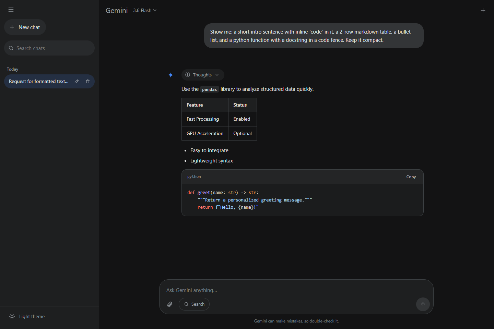

# Gemini Clone

A self-hosted clone of the Google Gemini web app, built to run entirely on free
tiers. Three providers, each doing what it is best at:

| Provider                 | Does                          | Why                                                        |
| ------------------------ | ----------------------------- | ---------------------------------------------------------- |
| **Groq**                 | Chat                          | Far more generous per-day free allowance than Gemini        |
| **Cloudflare Workers AI**| Text-to-image                 | Actually generates for free — Gemini's image quota is `0`   |
| **Gemini** *(optional)*  | PDF / audio / video input     | The only one here that accepts those                        |

React + Vite frontend, Express backend. The API keys stay on the server — the
browser only ever talks to your own `/api` routes, and never learns which
provider answered.



## Features

- **Streaming replies** over SSE, token by token, with a working stop button
- **Thinking** — collapsible "Thoughts" panel for the model's reasoning summaries
- **Multi-turn memory** that correctly replays Gemini 3 `thoughtSignature` values,
  so the model keeps its own reasoning context across turns
- **Model picker** across all three providers — GPT-OSS 120B/20B, Qwen 3.6,
  Llama 3.3 and 3.1, and Compound on Groq; FLUX.1 Schnell and SDXL on Cloudflare;
  the Flash/Pro and Nano Banana models on Gemini. Only models whose key is
  present are offered, so the picker can never show something that would fail.
- **Multimodal input** — drag, paste, or attach images, PDFs, audio, video and text
- **Text-to-image** with download, on Cloudflare's free allocation
- **Web search with cited sources** — the Search grounding toggle on Gemini, and
  the always-on Compound model on Groq
- **Markdown rendering** — syntax-highlighted code with copy buttons, tables, lists
- **Google sign-in** via Supabase, with chat history synced to Postgres so your
  conversations follow you across browsers and devices
- **Temporary chat** — the struck-through bubble in the top bar starts a throwaway
  conversation that is never written to the database and never appears in history
- **Chat history** with auto-generated titles, search, rename, and delete
- **Light and dark themes**, responsive down to phone widths
- Regenerate a reply, or edit and resend an earlier message

## Quick start

You need Node 20+, a Groq API key from
[console.groq.com/keys](https://console.groq.com/keys), and a free Supabase
project for sign-in (see [Setting up sign-in](#setting-up-sign-in)).

For **text-to-image**, also add Cloudflare Workers AI credentials — an account
ID from [dash.cloudflare.com](https://dash.cloudflare.com) → *Workers & Pages*,
and a token from *My Profile* → *API Tokens* using the **Workers AI** template.

A Gemini key from [aistudio.google.com/apikey](https://aistudio.google.com/apikey)
is optional, and only needed for PDF / audio / video input. Any provider you
leave unconfigured simply has its models hidden from the picker.

```bash
cp .env.example .env        # then fill in the keys
npm run install:all
npm run build               # build the UI
npm start                   # http://localhost:8787
```

If the Supabase values are missing the app still starts, but shows a setup
screen instead of the chat — sign-in is required.

## Setting up sign-in

Three steps: create the database, connect Google, then point the app at both.

### 1. Create the Supabase project and schema

Create a project at [supabase.com](https://supabase.com), open the **SQL
editor**, and run [`supabase/migrations/0001_init.sql`](supabase/migrations/0001_init.sql).

That creates a `chats` and `messages` table, a private `chat-media` storage
bucket for attachments and generated images, and the Row Level Security
policies that restrict every row and file to its owner.

### 2. Connect Google

In the **Google Cloud Console** → *APIs & Services* → *Credentials*, create an
**OAuth 2.0 Client ID** of type *Web application*, and set the authorised
redirect URI to:

```
https://<your-project-ref>.supabase.co/auth/v1/callback
```

Then in **Supabase** → *Authentication* → *Providers* → *Google*, enable the
provider and paste in the client ID and secret. Under *Authentication* → *URL
Configuration*, add the URLs you will actually open the app on:

```
http://localhost:8787      # production build
http://localhost:5173      # vite dev server
```

### 3. Point the app at it

From *Project Settings* → *API Keys*, copy the project URL and the
**publishable / anon** key into `.env`:

```ini
SUPABASE_URL=https://<your-project-ref>.supabase.co
SUPABASE_ANON_KEY=sb_publishable_...
```

Both are safe in a browser — the anon key is protected by RLS, not by secrecy.
**Do not use the `service_role` / secret key.** This app never needs one: the
server verifies sessions against your project's public JWKS endpoint, and all
data access goes through the user's own token so RLS always applies.

### Check your work

```bash
npm run check
```

This verifies each provider key (and that every model id in
[`server/models.js`](server/models.js) still exists upstream), the Supabase
connection, whether the Google provider is switched on, whether the migration
has run, and that the storage endpoint answers — naming the exact fix for
anything missing:

```
  Groq
  ✓ API key works, all Groq model ids exist

  Gemini
  ✓ API key works

  Cloudflare Workers AI (images)
  ✓ Credentials work, all 2 image model ids exist

  Supabase
  ✓ Project https://<ref>.supabase.co
  ✓ Auth API reachable, key accepted
  ✗ Google provider is NOT enabled
      → Supabase → Authentication → Providers → Google. …
  ✓ JWKS published (1 key, ES256)
  ✗ Table public.chats is missing
      → Run supabase/migrations/0001_init.sql in the Supabase SQL editor.
```

### Development (hot reload)

Runs the Vite dev server on `:5173` and proxies `/api` to the backend on `:8787`.

```bash
npm install                 # for `concurrently`
npm run dev                 # open http://localhost:5173
```

### Docker

```bash
docker compose up --build   # http://localhost:8787
```

`docker compose` reads `GROQ_API_KEY` (required) and `GEMINI_API_KEY`
(optional) from your `.env`.

Two images, one per service:

| Service | Image              | Contents                          | Published    |
| ------- | ------------------ | --------------------------------- | ------------ |
| `web`   | `gemini-clone-web` | nginx + the built React bundle     | `8787` → `80` |
| `api`   | `gemini-clone-api` | Express, holds the provider keys   | internal only |

`web` serves the static build and reverse-proxies `/api` to `api`
([`web/nginx.conf`](web/nginx.conf)), which keeps the browser same-origin — the
frontend's relative `fetch('/api/…')` calls need no API URL baked in at build
time, and no CORS is involved. `api` is not published to the host, so the only
route to it is through that proxy. It exposes `/api/health` as a Docker
healthcheck, and `web` waits on it so nginx never starts before its upstream.

The proxy sets `proxy_buffering off` and a 1h read timeout because `/api/chat`
is an SSE stream; with nginx's defaults a reply would arrive in one lump at the
end, and long generations would be cut at 60s.

To build or run one service on its own:

```bash
docker compose build api            # or: web
docker compose up -d api
docker build -t gemini-clone-api ./server
docker run -p 8787:8787 -e GROQ_API_KEY=your_key gemini-clone-api   # API only
```

To reach the API directly from the host for debugging, add a `ports` entry to
the `api` service:

```yaml
ports:
  - '8788:8787'   # then: curl localhost:8788/api/health
```

> **If chat times out in Docker but works with `npm start`**, something on the
> host is stopping *container* traffic from reaching the provider API. A VPN or
> filtering client is the usual cause — **Cloudflare WARP** does exactly this:
> the host reaches the API through the WARP tunnel while Docker's NAT bypasses
> it and the packets are dropped. DNS still resolves, so it looks like a hang. The app
> detects this and says so instead of reporting "fetch failed".
>
> Fixes, in order of preference:
>
> 1. Add the Docker bridge subnet (`172.17.0.0/16`) to WARP's split-tunnel
>    exclusions, or pause WARP.
> 2. Run the server directly on the host with `npm start` — unaffected.
>
> `--network host` is *not* a fix on Docker Desktop for Windows or macOS: the
> container joins the Linux VM's namespace, so egress starts working but
> `localhost:8787` is no longer reachable from your desktop.

## Configuration

| Variable            | Default | Purpose                                              |
| ------------------- | ------- | ---------------------------------------------------- |
| `GROQ_API_KEY`      | —       | Required. Serves the chat models.                     |
| `CLOUDFLARE_ACCOUNT_ID` | —   | Needed for text-to-image, with the token below.       |
| `CLOUDFLARE_API_TOKEN`  | —   | Needed for text-to-image. Workers AI permission.      |
| `GEMINI_API_KEY`    | —       | Optional. Needed only for PDF / audio / video input.  |
| `SUPABASE_URL`      | —       | Required for sign-in. `https://<ref>.supabase.co`.    |
| `SUPABASE_ANON_KEY` | —       | Required for sign-in. Publishable / anon key.          |
| `PORT`              | `8787`  | Port for the API and the built UI.                    |

Either key alone is a working app — `/api/models` only ever offers models whose
provider is configured, so the picker cannot show something that would fail.

Edit [`server/models.js`](server/models.js) to change which models appear in the
picker, and `STYLE_INSTRUCTION` in [`server/index.js`](server/index.js) to
change the assistant's behaviour.

## A note on free-tier quotas

Model availability depends on your key's plan, and the app surfaces the reason
when a request is rejected. Both providers retry `429`/`503` with backoff —
honouring Groq's `retry-after` header — before reporting a limit was reached.

On a free **Groq** key, the daily request allowance is generous but the
**tokens-per-minute ceiling is low**, and it is what you will actually hit. A
long conversation resends its whole history every turn, so the same chat gets
more expensive as it grows: start a new chat, or drop to Llama 3.1 8B, which has
the highest limits here.

**Cloudflare Workers AI** gives a fixed daily allocation of Neurons, which is
good for a few dozen images a day. When it runs out the app says so and the
allowance resets the next day.

On a free **Gemini** key:

- **Flash models** — work well.
- **Pro models** — very low requests-per-minute; easy to hit `429`.
- **Image generation and Search grounding** — quota of **`0`**, verified against
  a live key: `gemini-3-pro-image`, `gemini-3.1-flash-image` and
  `gemini-2.5-flash-image` all reject with
  `limit: 0, generate_content_free_tier_requests`. This is a billing state, not
  a rate limit, so retrying never helps — which is exactly why image generation
  routes to Cloudflare by default. The Gemini image models stay in the
  catalogue and start working the moment billing is enabled on the key.

## How it works

```
web/  React UI     → POST /api/chat with a Supabase access token, reads SSE
                   → reads/writes chats directly in Postgres (RLS enforced)
server/  Express   → verifies the token, then routes by the model's provider to
                     api.groq.com, api.cloudflare.com, or
                     generativelanguage.googleapis.com
Supabase           → Google OAuth, Postgres chat history, private media bucket
```

Chat data goes browser → Supabase directly; only model calls pass through the
Express server, which holds the provider keys. The server has no database
credentials at all.

Each provider lives in its own module — [`server/groq.js`](server/groq.js),
[`server/cloudflare.js`](server/cloudflare.js) and
[`server/gemini.js`](server/gemini.js) — behind the same `streamChat` /
`generateText` signatures, all emitting the same normalised events. Groq speaks
the OpenAI chat-completions dialect and Cloudflare takes a bare prompt string,
so the Gemini-shaped `contents` the browser sends are translated inside those
modules rather than in the route. The result is that neither the route nor the
UI knows which provider answered:

```jsonc
{ "type": "thought",  "text": "..." }              // reasoning summary
{ "type": "text",     "text": "..." }              // answer text
{ "type": "image",    "mimeType": "...", "data": "<base64>" }
{ "type": "sources",  "items": [ { "uri": "...", "title": "..." } ] }
{ "type": "usage",    "totalTokens": 687, "thoughtTokens": 583 }
{ "type": "done",     "parts": [ ... ] }           // replayed on the next turn
{ "type": "error",    "message": "..." }
```

### API

| Route         | Method | Auth | Purpose                                          |
| ------------- | ------ | ---- | ------------------------------------------------ |
| `/api/health` | GET    | —    | Liveness, and whether keys are configured.        |
| `/api/config` | GET    | —    | Browser-safe Supabase config, read at runtime.    |
| `/api/models` | GET    | ✓    | The model catalogue — configured providers only.  |
| `/api/chat`   | POST   | ✓    | Streams a reply as SSE.                          |
| `/api/title`  | POST   | ✓    | Short chat title for the sidebar.                |

Authenticated routes need `Authorization: Bearer <supabase access token>` and
answer `401` otherwise, so nobody can spend your quota by hitting the API
directly.

### Notable implementation details

- **Client disconnects** are detected on `res`, not `req` — `req` emits `close`
  as soon as the body is read, which would abort every request instantly.
- **Titles treat the user's message as data**, fenced in `<message>` tags, so a
  message like "reply with a heading" gets labelled instead of obeyed.
- **Title generation avoids reasoning models** — on Gemini via `thinkingBudget: 0`,
  on Groq by picking Llama 3.1 8B. With a small token cap a reasoning model
  spends the whole budget on thoughts and returns no text at all.
- **Generated image MIME types are sniffed, not assumed.** Workers AI returns
  unlabelled base64 whose real format varies by model — `flux-1-schnell` hands
  back JPEG, SDXL raw PNG bytes. The browser uses that value for both the data
  URI and the download filename, so it is read from the magic bytes.
- **Zero quota is distinguished from rate limiting.** A Gemini `429` carrying
  `limit: 0` is a billing state, so it is reported as one and not retried —
  otherwise every image attempt burned ~30s of backoff before the same failure.
- **Model output is sanitized** with DOMPurify before rendering.
- **Attachment MIME types are allow-listed** server-side.
- **Sessions are verified without secrets** — tokens are checked against the
  project's public JWKS, falling back to the Auth API for legacy projects that
  still sign with a shared HS256 secret. Verified users are cached for 60s so
  the fallback does not run per message.
- **Media never goes in the database.** Attachments and generated images upload
  to the private `chat-media` bucket under `<user_id>/<chat_id>/`, and only the
  path is stored. Reads use short-lived signed URLs.
- **Chats persist lazily.** A new chat exists only in memory until its first
  message, so the sidebar and database never fill with empty rows.
- **Temporary chats skip persistence entirely** rather than deleting afterwards.
  The `temporary` flag short-circuits every write — chat creation, message saves,
  title generation, and truncation on regenerate/edit — so nothing reaches
  Postgres or Storage even if the turn errors mid-stream.

## Limitations

- **Image models have no conversation memory.** FLUX and SDXL are text-to-image:
  they take a prompt, not a history. Only the newest message is used, so a
  follow-up like "make it blue" draws a blue *something else* rather than
  editing the previous image. Earlier turns are dropped deliberately —
  concatenating them produces an image matching neither prompt. Describe the
  whole image each time. Editing an existing image needs Gemini's Nano Banana
  models, which require billing.
- **Concurrent edits to one chat are last-write-wins.** Message order uses a
  client-assigned sequence number, so editing the same conversation from two
  devices at once can collide. Separate chats are unaffected.
- Sign-in is required and Google is the only provider wired up. Supabase
  supports others; they would need adding to the login screen.
- No Canvas, Gems, or Deep Research — this covers the core chat experience.

## Licence

MIT. Not affiliated with Google; "Gemini" is Google's trademark.
# Gemini-Clone

# Gemini-Clone

# Gemini-Clone

