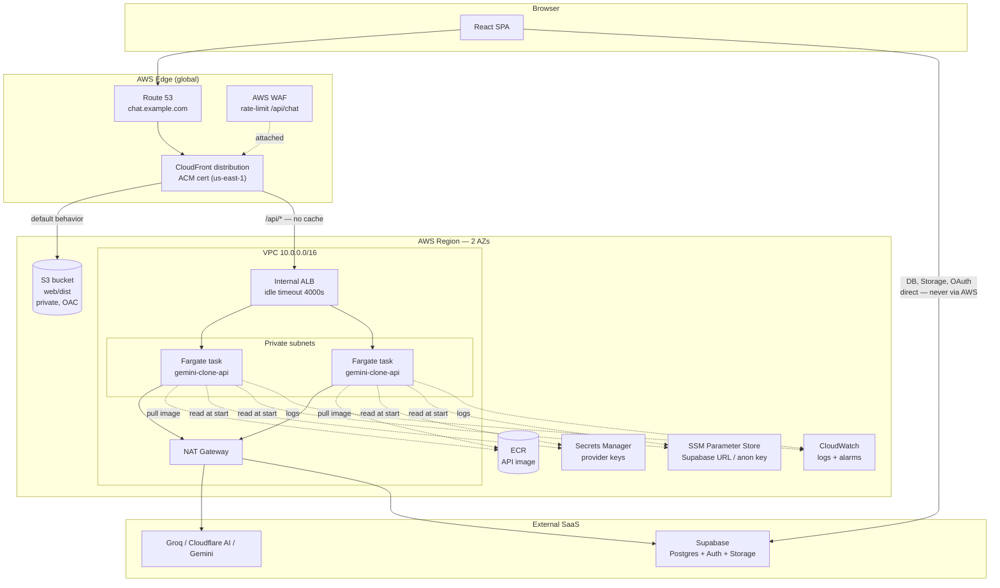
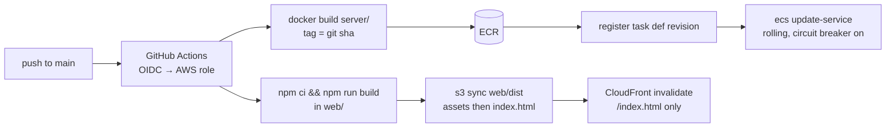

# Deploying on AWS — architecture design

How to run this app on AWS. Recommended target is **S3 + CloudFront for the UI,
ECS Fargate behind an ALB for the API**, with Supabase left where it is.
Alternatives, and why they lose, are in [Alternatives](#alternatives).

---

## 1. What is actually being deployed

| Piece | What it is | Deployment consequence |
| --- | --- | --- |
| `web/` | Vite → React SPA, builds to `web/dist`. All API calls are relative (`fetch('/api/…')`). | Pure static assets. Needs a same-origin `/api` path, not a hardcoded API URL. |
| `server/` | Express 4 on Node 22. Routes: `/api/health`, `/api/config`, `/api/models`, `/api/chat` (SSE), `/api/title`. | Long-lived streaming HTTP. Holds the provider keys. |
| `web/nginx.conf` | Serves the bundle + proxies `/api` to the API container. | **Replaced** by CloudFront behaviors. Its settings become CloudFront/ALB config. |
| Supabase | Postgres (chats, messages, RLS), Storage (`chat-media`), Google OAuth. | External SaaS. The browser talks to it directly; AWS never proxies it. |
| Providers | Groq, Cloudflare Workers AI, Gemini — all outbound HTTPS. | The API tasks need egress to the internet. |

### Runtime constraints that drive the design

These are the properties that make this app different from a generic CRUD service:

1. **`/api/chat` is Server-Sent Events**, held open for the whole generation
   ([`server/index.js:260-336`](../server/index.js#L260-L336)). `nginx.conf` sets
   `proxy_read_timeout 1h`. Any AWS hop with a short, non-extendable timeout is
   disqualified.
2. **Client disconnect must propagate upstream.** The stop button works because
   `res.on('close')` aborts the provider fetch
   ([`server/index.js:274-277`](../server/index.js#L274-L277)). Losing this means
   paying for tokens nobody reads.
3. **The API is stateless.** The only in-process state is a 60 s JWT→user cache
   ([`server/auth.js:17-18`](../server/auth.js#L17-L18)) — a cold task just
   re-verifies. So: no sticky sessions, no shared cache tier, scale freely.
4. **Config is served at runtime, not baked in.** `/api/config` hands the browser
   the Supabase URL and anon key ([`server/index.js:249-252`](../server/index.js#L249-L252)),
   so one image and one bundle work across every environment.
5. **No database or object storage is needed on AWS.** Supabase RLS is the only
   thing isolating users' chats, and the server deliberately holds no
   `service_role` key.

---

## 2. Recommended architecture



The shape to notice: **the browser reaches exactly one origin** (the CloudFront
domain) for both the UI and the API, so the SPA's relative `fetch('/api/…')` calls
work with zero code change and no CORS preflight — the same property `nginx.conf`
was providing, moved to the edge.

**Region choice: `ap-south-1` (Mumbai).** The existing Supabase project runs there, and
that is the one server-to-Supabase hop in the design — `auth.js` verifies every request's
JWT against the project's JWKS endpoint (cached 60 s, so it is not per-message, but it is
on the critical path of a cold token). Same-region keeps it single-digit milliseconds.
Nothing else about the design is region-dependent, except that the CloudFront certificate
must still be issued in `us-east-1` (see §3.2) and Fargate/NAT pricing in `ap-south-1`
runs slightly below the `us-east-1` figures quoted in §6.

---

## 3. Component specification

### 3.1 S3 — static bundle

- Private bucket, versioning on, SSE-S3 encryption, **no public access**.
- Access only via CloudFront **Origin Access Control (OAC)**, not the legacy OAI.
- Upload with cache headers mirroring `nginx.conf` — the reasoning there still holds:

  | Path | `Cache-Control` | Why |
  | --- | --- | --- |
  | `/assets/*` | `public, max-age=31536000, immutable` | Vite content-hashes these; they can never go stale. |
  | `index.html` | `no-cache` | Otherwise a deploy ships assets no browser is told to fetch. |

### 3.2 CloudFront — the replacement for nginx

Two origins, two behaviors:

| Behavior | Path pattern | Origin | Policy |
| --- | --- | --- | --- |
| API | `/api/*` | ALB | Cache policy **`CachingDisabled`**; origin request policy **`AllViewerExceptHostHeader`**; allowed methods `GET,HEAD,OPTIONS,PUT,POST,PATCH,DELETE`. |
| Default | `*` | S3 | Cache policy `CachingOptimized`; `GET,HEAD` only. |

Non-obvious settings that this app specifically needs:

- **Custom error responses for SPA routing.** With OAC on a private bucket a missing
  key returns **403**, not 404. Map *both* `403` and `404` → `/index.html` with
  response code `200`. This is the equivalent of nginx's
  `try_files $uri $uri/ /index.html`. Scope it so it cannot swallow API errors —
  because `/api/*` is a separate behavior pointed at the ALB, custom error responses
  configured for the S3 origin path do not apply to it, but verify this in a smoke
  test (a 404 from `/api/nope` must return JSON, not HTML).
- **Origin response timeout.** Default 30 s, max 60 s (a quota increase can raise it
  to 180 s). This is a *gap-between-bytes* timeout, not a total-duration cap — so an
  SSE stream of any length is fine **as long as bytes keep flowing**. A thinking
  model that pauses for 30 s with nothing on the wire will get its connection cut.
  See [§7, keepalive](#7-code-changes-needed-before-deploy).
- **Do not enable Origin Shield** for the API behavior — it adds a hop to a
  streaming path for no cache benefit.
- Compression: leave CloudFront compression on for the S3 behavior. For `/api/*` it
  is harmless (`text/event-stream` is not in CloudFront's compressible list), but the
  server already sets `no-transform`.
- HTTPS only, TLSv1.2_2021 minimum, HTTP/2 + HTTP/3.
- ACM certificate **must be issued in `us-east-1`** regardless of the app's region.

### 3.3 WAF — attached to CloudFront

Worth the $5/month here for one specific reason: **every `/api/chat` call spends real
provider money**. `requireUser` blocks anonymous callers, but a compromised or
enthusiastic account can still run the bill up.

- Rate-based rule: e.g. 300 requests / 5 min per IP, scoped to `/api/*`.
- `AWSManagedRulesCommonRuleSet` and `AWSManagedRulesKnownBadInputsRuleSet`.
- **Exclude `SizeRestrictions_BODY`** from the common rule set on `/api/chat` — the
  managed rule inspects the first 8 KB by default and attachments are base64'd into a
  32 MB JSON body (`express.json({ limit: '32mb' })`,
  [`server/index.js:140`](../server/index.js#L140)). Left as-is it will block image
  uploads.
- Deploy in **Count mode first**, read the sampled requests for a day, then Block.

### 3.4 VPC and networking

| Resource | Config |
| --- | --- |
| VPC | `10.0.0.0/16`, 2 AZs minimum (ALB requires two subnets). |
| Public subnets | ALB (if internet-facing) + NAT Gateway. |
| Private subnets | Fargate tasks. |
| NAT | One NAT Gateway (single-AZ NAT is an acceptable cost/HA trade for this app; two for full AZ independence). |
| Security group `alb-sg` | Inbound 443 from the CloudFront managed prefix list `com.amazonaws.global.cloudfront.origin-facing` only. |
| Security group `api-sg` | Inbound 8787 **from `alb-sg` only**. Outbound 443 anywhere (providers + Supabase). |

**Two ways to keep the ALB off the open internet** — pick one:

1. **CloudFront VPC origins** (GA since late 2024) — point CloudFront directly at an
   **internal** ALB in private subnets. Cleanest: the ALB has no public DNS at all.
   Recommended.
2. **Internet-facing ALB + shared-secret header.** CloudFront adds a custom origin
   header (`X-Origin-Verify: <random>`); a WAF rule on the ALB blocks anything without
   it. Rotate the secret via Secrets Manager. Use this if VPC origins are unavailable
   in your region.

Prefix-list-only ingress alone is *not* sufficient — it permits any CloudFront
distribution, including someone else's.

### 3.5 ALB

| Setting | Value | Reason |
| --- | --- | --- |
| `idle_timeout` | **4000 s** (the max) | Replaces nginx's `proxy_read_timeout 1h`. The 60 s default would sever every long generation. |
| Listener | HTTPS :443 → target group :8787 | Terminate with an ACM cert **in the app's region** (separate from the CloudFront cert). |
| Target group | `HTTP`, port 8787, target type `ip` | Required for Fargate `awsvpc` networking. |
| Health check | `GET /api/health`, 200, interval 15 s, healthy 2 / unhealthy 3 | Already implemented and dependency-free — it reports key presence but always 200s, which is correct for liveness. |
| `deregistration_delay` | **300 s** | Lets in-flight streams finish during a deploy instead of being cut mid-answer. |
| Access logs | on, to S3 | The only place you will see per-request status for the API. |

### 3.6 ECS Fargate — the API

- Cluster: Fargate + Fargate Spot capacity providers, but **run the API on on-demand
  only**. Spot's 2-minute interruption notice is shorter than a long generation, so
  Spot tasks visibly truncate answers.
- Task size: **0.25 vCPU / 0.5 GB** to start. The work is I/O-bound — tasks spend
  their time awaiting provider fetches, not computing — so a single Node process
  handles a lot of concurrent streams. Watch CPU before upsizing.
- Task definition, container `api`, from `server/Dockerfile` unchanged:

  ```jsonc
  {
    "image": "<acct>.dkr.ecr.<region>.amazonaws.com/gemini-clone-api:<git-sha>",
    "portMappings": [{ "containerPort": 8787, "protocol": "tcp" }],
    "environment": [{ "name": "PORT", "value": "8787" }],
    "secrets": [
      { "name": "GROQ_API_KEY",           "valueFrom": "arn:…:secret:gemini-clone/providers:GROQ_API_KEY::" },
      { "name": "CLOUDFLARE_ACCOUNT_ID",  "valueFrom": "arn:…:secret:gemini-clone/providers:CLOUDFLARE_ACCOUNT_ID::" },
      { "name": "CLOUDFLARE_API_TOKEN",   "valueFrom": "arn:…:secret:gemini-clone/providers:CLOUDFLARE_API_TOKEN::" },
      { "name": "GEMINI_API_KEY",         "valueFrom": "arn:…:secret:gemini-clone/providers:GEMINI_API_KEY::" },
      { "name": "SUPABASE_URL",           "valueFrom": "arn:…:parameter/gemini-clone/SUPABASE_URL" },
      { "name": "SUPABASE_ANON_KEY",      "valueFrom": "arn:…:parameter/gemini-clone/SUPABASE_ANON_KEY" }
    ],
    "stopTimeout": 120,
    "logConfiguration": {
      "logDriver": "awslogs",
      "options": {
        "awslogs-group": "/ecs/gemini-clone-api",
        "awslogs-region": "<region>",
        "awslogs-stream-prefix": "api"
      }
    }
  }
  ```

  The image's own `HEALTHCHECK` is harmless but redundant under ECS — the ALB target
  group is what governs traffic. `dotenv` finding no `.env` file is a no-op; real
  environment variables win, exactly as the comment at
  [`server/index.js:86-90`](../server/index.js#L86-L90) describes.

- Service: desired count 2 (one per AZ), rolling deploy with
  `minimumHealthyPercent: 100`, `maximumPercent: 200`, and **circuit breaker with
  rollback enabled**.
- `stopTimeout: 120` (the Fargate maximum) — pairs with SIGTERM handling in §7 so a
  deploy drains streams rather than killing them.
- **Two IAM roles, kept distinct:**
  - *Execution role* — pull from ECR, write logs, **read the secrets** (this is the
    role that resolves `secrets[]`).
  - *Task role* — the app's own AWS permissions. This app calls no AWS APIs at
    runtime, so give it **nothing**. Do not merge the two.

### 3.7 Autoscaling

Target-tracking on CPU is the wrong primary signal here: a task holding 200 idle SSE
streams shows low CPU while being close to its connection ceiling. Use:

- **Primary:** target tracking on ALB `ActiveConnectionCount / running task count`
  (a CloudWatch math expression), target ~150 connections per task.
- **Secondary:** CPU target tracking at 60 % as a backstop.
- Min 2, max 10. Scale-in cooldown **long** (600 s) — aggressive scale-in cuts live
  streams, and the deregistration delay means each removal is slow anyway.

### 3.8 Secrets and configuration

| Value | Store | Why |
| --- | --- | --- |
| `GROQ_API_KEY`, `CLOUDFLARE_ACCOUNT_ID`, `CLOUDFLARE_API_TOKEN`, `GEMINI_API_KEY` | **Secrets Manager**, one JSON secret with 4 keys | Genuinely secret; rotation and audit matter. One secret = $0.40/mo instead of $1.60. |
| `SUPABASE_URL`, `SUPABASE_ANON_KEY` | **SSM Parameter Store** (Standard, `String`) | Browser-safe by design — the anon key is protected by RLS, not secrecy ([`.env.example`](../.env.example)). Free tier, no reason to pay. |
| `PORT` | Task definition literal | Not configuration in any meaningful sense. |

No `service_role` key exists anywhere in this design. That is deliberate and should
stay true.

### 3.9 Supabase — what changes

Supabase stays as-is; only two things need updating for the new hostname:

1. **Auth → URL Configuration**: set Site URL to `https://chat.example.com` and add
   it to Redirect URLs. Google sign-in silently fails otherwise.
2. Google OAuth client (in Google Cloud console): add the Supabase callback URL if
   not already present.

Run [`supabase/migrations/0001_init.sql`](../supabase/migrations/0001_init.sql) once
against the project if it hasn't been. Nothing in it is AWS-specific.

If you want Supabase on AWS too, see [Alternatives](#alternatives) — it is a real
rewrite, not a config change.

### 3.10 Observability

- **Logs:** CloudWatch Logs `/ecs/gemini-clone-api`, 30-day retention. The server
  already logs `[chat]` and `[title]` failures with the upstream error code.
- **Metrics worth alarming on:**
  | Alarm | Condition |
  | --- | --- |
  | ALB 5xx | `HTTPCode_ELB_5XX_Count` > 5 in 5 min |
  | Target 5xx | `HTTPCode_Target_5XX_Count` > 10 in 5 min |
  | Unhealthy targets | `UnHealthyHostCount` ≥ 1 for 2 periods |
  | Task churn | ECS service `RunningTaskCount` < desired for 10 min |
  | Provider failures | Metric filter on `[chat]` log lines, > 20 in 5 min |
  | Cost | AWS Budgets alert — the provider bills are elsewhere, but WAF/NAT data can surprise you |
- **Traces:** skip X-Ray initially. The call graph is one hop deep; CloudWatch Logs
  Insights over the `[chat]` lines answers most questions.

---

## 4. Request flows

### Loading the app

```
Browser → CloudFront (default behavior) → S3 → index.html (no-cache)
        → CloudFront → S3 → /assets/*.js (cache hit, immutable)
        → CloudFront (/api/* behavior) → ALB → Fargate → /api/config
          { supabaseUrl, supabaseAnonKey, authConfigured }
        → Browser → Supabase (direct) → Google OAuth → session
        → CloudFront → ALB → Fargate → /api/models  (Bearer token verified)
```

### A chat turn

```
Browser POST /api/chat  (Bearer <supabase jwt>, up to 32 MB JSON)
  → CloudFront  (CachingDisabled, AllViewerExceptHostHeader)
  → ALB         (idle timeout 4000s)
  → Fargate     requireUser → JWKS verify (cached 60s)
                → provider.streamChat → Groq / Cloudflare / Gemini via NAT
                ← SSE frames stream back, unbuffered, hop by hop
Stop button → browser aborts → CloudFront/ALB drop the upstream request
            → res 'close' → AbortController.abort() → provider fetch cancelled
```

Chat history and media never traverse AWS — the browser writes rows and uploads to
Supabase directly under RLS.

---

## 5. CI/CD

GitHub Actions with **OIDC federation** — no long-lived AWS access keys in the repo.



Two ordering details that matter:

1. **Sync `/assets/*` before `index.html`.** Reverse order briefly serves a new
   `index.html` pointing at assets that are not uploaded yet.
2. **Invalidate `/index.html` only, never `/*`.** Assets are content-hashed, so
   invalidating them is pure waste (and only the first 1,000 paths/month are free).

Also in the pipeline:

- `npm run check` (`server/check.js`) as a pre-deploy gate.
- Post-deploy smoke test: `curl -f https://chat.example.com/api/health` and assert
  `hasKey === true && authConfigured === true`. A deploy where the secrets failed to
  resolve otherwise looks perfectly healthy — the server is designed to boot without
  keys and just log a warning ([`server/index.js:386-404`](../server/index.js#L386-L404)).

For a staging environment, deploy the same stack into a second account (or a
`-staging` name prefix) with its own Supabase project. The image and the bundle are
environment-agnostic by construction, so nothing needs rebuilding per environment.

---

## 6. Cost estimate

Low-traffic production, `us-east-1`, monthly, excluding provider and Supabase bills:

| Item | Cost |
| --- | --- |
| ALB (1) | ~$16 + LCU (~$3) |
| Fargate 2 × 0.25 vCPU / 0.5 GB | ~$18 |
| NAT Gateway (1) | ~$33 + $0.045/GB |
| CloudFront + S3 | ~$1–3 (1 TB/mo egress is free tier) |
| WAF (1 ACL + 3 rules) | ~$8 |
| Secrets Manager (1 secret) | $0.40 |
| Route 53 hosted zone | $0.50 |
| CloudWatch logs/metrics | ~$3 |
| **Total** | **≈ $85/month** |

**The NAT Gateway and the ALB are 60 % of that bill.** Two legitimate ways to cut it:

- **Drop NAT** — run the Fargate tasks in *public* subnets with `assignPublicIp:
  ENABLED`. Inbound is still closed (`api-sg` only accepts the ALB's SG), and outbound
  goes straight to the internet gateway. Saves ~$33/mo. This is a reasonable trade for
  a small app; it fails a strict "no workload in public subnets" policy.
- **Drop the ALB** — see the App Runner and Lambda options below.

Stripping NAT and WAF puts the floor near **$40/month**.

---

## 7. Code changes needed before deploy

The app runs on AWS essentially unmodified. These four changes are the difference
between "runs" and "runs correctly", and all are small:

1. **SSE keepalive** — *required.* Emit a comment frame (`: ping\n\n`) every ~15 s
   while a generation is in flight. CloudFront's origin response timeout (30 s
   default) measures the gap between bytes, so a model that thinks silently for
   longer than that gets its connection cut and the user sees a truncated answer.
   The `send()` helper at [`server/index.js:267`](../server/index.js#L267) is the
   place to hang a timer.
2. **SIGTERM graceful shutdown** — *required for clean deploys.* `app.listen` has no
   signal handler ([`server/index.js:379`](../server/index.js#L379)), so ECS's
   SIGTERM does nothing and the task is SIGKILLed, cutting every live stream. Add:
   stop accepting new connections, let in-flight SSE responses finish, exit. Pair
   with `stopTimeout: 120` and `deregistration_delay: 300`.
3. **Tighten CORS** — `app.use(cors())` ([`server/index.js:139`](../server/index.js#L139))
   currently allows every origin. Behind CloudFront everything is same-origin, so
   restrict it to the known hostname (or drop the middleware for production and keep
   it for the Vite dev server via an env check).
4. **`app.set('trust proxy', true)`** — only matters if you add per-IP or per-user
   rate limiting at the app layer, but without it every request appears to come from
   the ALB. Worth adding now: WAF rate-limits by IP, and a per-*user* limit inside
   the app is the thing that actually caps provider spend.

Nothing else needs touching. `server/Dockerfile` ships as-is;
[`web/nginx.conf`](../web/nginx.conf) and [`docker-compose.yml`](../docker-compose.yml)
stay for local development.

---

## 8. Bring-up order

Each step is independently verifiable, so a failure is localised:

1. Route 53 hosted zone; ACM certs — one in `us-east-1` (CloudFront), one in the app
   region (ALB).
2. VPC, subnets, IGW, NAT, security groups.
3. ECR repository; build and push the API image; `aws ecr describe-images` to confirm.
4. Secrets Manager secret + SSM parameters.
5. IAM execution and task roles.
6. ALB, target group, HTTPS listener.
7. ECS cluster, task definition, service → **verify the target group goes healthy
   before adding CloudFront.** Reach the ALB directly from a bastion or by temporarily
   allowing your own IP.
8. S3 bucket + OAC; `aws s3 sync web/dist`.
9. CloudFront distribution with both behaviors and the custom error responses.
10. Point DNS at CloudFront.
11. **Update the Supabase Site URL and Redirect URLs** — sign-in stays broken until
    this is done, and the failure mode looks like an app bug.
12. WAF in Count mode; review sampled requests; switch to Block.
13. Alarms, budgets, autoscaling policies.
14. GitHub Actions OIDC role and the deploy workflow.

Smoke tests before calling it done: `/api/health` reports `hasKey` and
`authConfigured` true; Google sign-in completes; a chat streams token-by-token (not in
one lump at the end); the stop button halts generation; an image upload of a few MB
succeeds; a hard refresh on a deep client-side route returns the app, not XML.

---

## Alternatives

### App Runner instead of ALB + Fargate

`server/Dockerfile` deploys to App Runner with no ALB, no VPC, no NAT — roughly
**$25/month** and far less to operate. The trade: App Runner enforces its own request
timeout (120 s by default) and gives you much less control over the streaming path
than an ALB whose idle timeout you can set to 4000 s. **Verify current App Runner
timeout limits against long SSE generations before choosing this** — a model that
takes three minutes to answer is not unusual here. Good choice for staging or a demo;
verify before production.

### Lambda response streaming instead of containers

A Function URL with `awslambda.streamifyResponse` behind CloudFront costs near-zero
at idle. Two real problems:

- **The stop button stops working.** Lambda gives the handler no client-disconnect
  signal, so `res.on('close')` never fires and the provider request runs to
  completion — you pay for tokens nobody reads. That is a functional regression, not
  a tuning issue.
- Express's `res.write` contract has to be shimmed onto Lambda's writable stream, plus
  a 15-minute hard ceiling and cold starts on the first token.

Choose it only for a cost-floor demo, accepting the degraded stop behaviour.

### One EC2 box running `docker compose`

`docker-compose.yml` already works. A `t4g.small` with an Elastic IP is ~$12/month and
deploys with `git pull && docker compose up -d`. No HA, no zero-downtime deploys, and
you own the patching. Genuinely the right answer for a personal instance; not for
anything with users who would notice an outage.

### Replacing Supabase with AWS-native services

Cognito (auth) + Aurora Serverless v2 or RDS Postgres (data) + S3 (media). Fully
in-VPC and single-vendor, but it is a rewrite, not a migration:

- [`web/src/lib/db.js`](../web/src/lib/db.js) and
  [`web/src/lib/supabase.js`](../web/src/lib/supabase.js) call `supabase-js` directly
  from the browser. Postgres has no browser client, so **every query becomes a new API
  route** on the Express server — the server grows from 5 routes to ~15 and stops
  being stateless-and-keyless.
- RLS policies in `0001_init.sql` move into application-layer authorization, which is
  strictly easier to get wrong.
- Signed S3 URLs replace Supabase Storage policies; Cognito replaces the JWKS
  verification in `auth.js` (similar shape, different issuer).

Do this only if a compliance requirement forbids the third-party dependency. The
current design's best property is that AWS holds no user data at all.

### Comparison

| | S3+CF+Fargate **(recommended)** | App Runner | Lambda streaming | Single EC2 |
| --- | --- | --- | --- | --- |
| Cost/mo | ~$85 (~$40 trimmed) | ~$25 | ~$5 | ~$12 |
| SSE ≥ 3 min | Yes (4000 s) | Verify limits | Yes (15 min cap) | Yes |
| Stop button | Works | Works | **Broken** | Works |
| HA | Multi-AZ | Managed | Managed | None |
| Zero-downtime deploy | Yes | Yes | Yes | No |
| Code changes | 4 small (§7) | 4 small | Handler rewrite | None |
| Ops burden | Medium | Low | Low | You patch the box |
